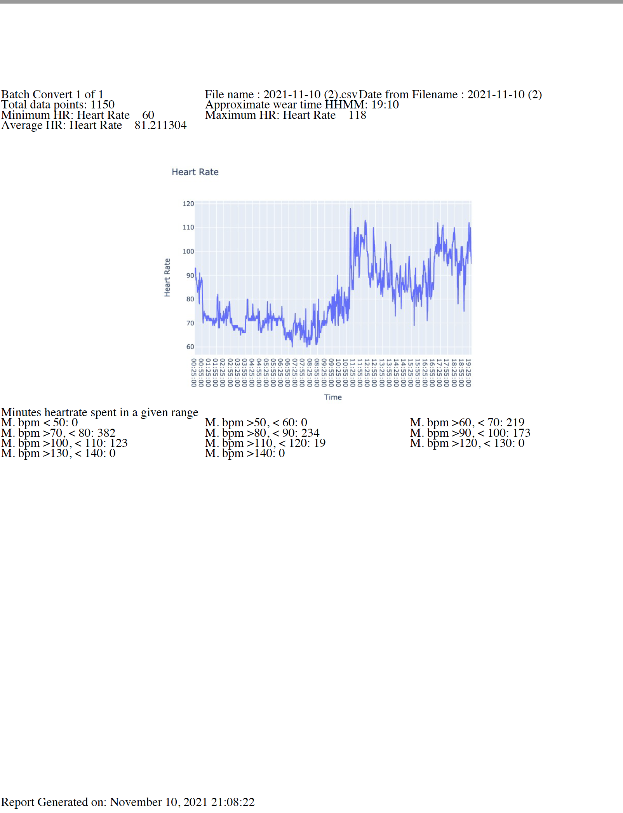

#  fitbit_hr_to_report
## A simple tool to create a basic reports from Fitbit heart rate monitoring.

### Guide

1. Install requirements `pip3 install -r requirements.txt`
2. Download your Fitbit HR records using the following tool [Pulse Watch — Fitbit heart rate data exporter and visualizer](https://iccir919.github.io/pulseWatch/public/)
	1. Signin into Fitbit
	2. Select Single day time series
	3. Select the date you wish to download data for
	4. Do not change time range
	5. Ensure that detail level is set to per Minute
	6. Click Get The Data 
	7. Click Download to .csv
	8. Repeat for all dates that you wish to pull data for 
3. Copy all .csv files into `raw_csv` folder
4. Run command `python3 driver.py`
5. The driver will run and will create the report for each day in the `raw_csv/per_day_pdf_out` subfolder

Example Output report:

